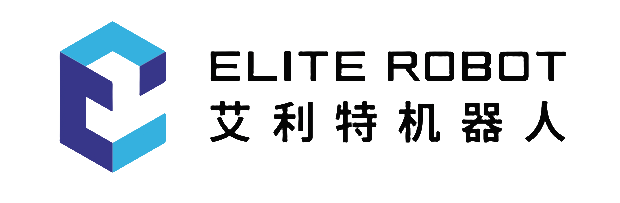

<a name="readme-top"></a>

<!-- [![Contributors][contributors-shield]][contributors-url]
[![Forks][forks-shield]][forks-url]
[![Stargazers][stars-shield]][stars-url]
[![Issues][issues-shield]][issues-url]
[![MIT License][license-shield]][license-url]
[![LinkedIn][linkedin-shield]][linkedin-url] -->


<!-- PROJECT LOGO -->
<br />

<div align="center">
  <a href="https://github.com/Elite-Robots/EliPlugin-learning">
    
  </a>

<h3 align="center">CS插件开发教学文档</h3>

  <p align="center">
    本文档为艾利特CS系列机器人插件开发培训，旨在让开发者快速熟悉CS整体开发流程。
    <br />
    <a href="https://github.com/Elite-Robots/EliPlugin-learning"><strong>浏览文档 »</strong></a>
    <br />
    <br />
    <a href="https://github.com/Elite-Robots/EliPlugin-learning">示例Demo</a>
    ·
    <a href="https://github.com/Elite-Robots/EliPlugin-learning/issues">报告Bug</a>
    ·
    <a href="https://github.com/Elite-Robots/EliPlugin-learning/issues">请求功能</a>
  </p>
</div>


<!-- TABLE OF CONTENTS -->
<details>
  <summary>主要内容</summary>
  <ol>
    <li>
      <a href="#about-the-project">关于此工程</a>
      <!-- <ul>
        <li><a href="#built-with">构建</a></li>
      </ul> -->
    </li>
    <li>
      <a href="#getting-started">开始</a>
      <ul>
        <li><a href="#prerequisites">前置条件</a></li>
        <li><a href="#installation">安装</a></li>
      </ul>
    </li>
    <li><a href="#usage">使用</a></li>
    <li><a href="#roadmap">路线</a></li>
    <li><a href="#contributing">贡献</a></li>
    <li><a href="#license">许可</a></li>
    <li><a href="#contact">联系我们</a></li>
    <!-- <li><a href="#acknowledgments">Acknowledgments</a></li> -->
  </ol>
</details>


<!-- ABOUT THE PROJECT -->
## 关于此项目

[![Product Name Screen Shot][product-screenshot]](https://example.com)
此项目为艾利特CS插件开发教程，包含中英双语。开发者可通过此教程学习如何在艾利特CS系列机器人的虚拟机上，使用艾利特提供的SDK进行插件开发。最终将您的夹爪，视觉，传感器等任何末端工具，集成到艾利特CS示教器中。


<p align="right">(<a href="#readme-top">back to top</a>)</p>


<!-- ### 构建环境 -->

<!-- * [![InteliJ IDEA][InteliJ]][InteliJ-url]
* [![React][React.js]][React-url]
* [![Vue][Vue.js]][Vue-url]
* [![Angular][Angular.io]][Angular-url]
* [![Svelte][Svelte.dev]][Svelte-url]
* [![Laravel][Laravel.com]][Laravel-url]
* [![Bootstrap][Bootstrap.com]][Bootstrap-url]
* [![JQuery][JQuery.com]][JQuery-url] -->

<!-- * InteliJ IDEA
* EliSim
* ElitePluginSDK -->

<p align="right">(<a href="#readme-top">back to top</a>)</p>


<!-- GETTING STARTED -->
## 开始

克隆项目
   ```sh
   git clone https://github.com/Elite-Robots/EliPlugin-learning.git
   ```

### 前置条件

* 需具备Java语言基础知识
* 需了解CS机器人的基本操作及安全知识


<!-- ### 安装 -->


<!-- 3. Install NPM packages
   ```sh
   npm install
   ```
4. Enter your API in `config.js`
   ```js
   const API_KEY = 'ENTER YOUR API';
   ```

<p align="right">(<a href="#readme-top">back to top</a>)</p> -->


<!-- USAGE EXAMPLES -->
<!-- ## Usage

Use this space to show useful examples of how a project can be used. Additional screenshots, code examples and demos work well in this space. You may also link to more resources.

_For more examples, please refer to the [Documentation](https://example.com)_

<p align="right">(<a href="#readme-top">back to top</a>)</p>
 -->


<!-- ROADMAP -->
## 导航

- [x] 概览
- [x] 各节点介绍
- [x] 整体运行原理和变量介绍
- [x] 插件集成原理
    - [x] 任务节点实现
    - [x] 配置节点实现
    - [x] 导航栏实现
- [ ] Elite Plugin新建项目
- [ ] 第一个插件-LightUp
    - [ ] LightUp需求说明
    - [ ] LightUp基本结构
    - [ ] LightUp View
    - [ ] LightUp Contribution
- [ ] 插件部署

提问及待更新的内容详见 [open issues](https://github.com/Elite-Robots/EliPlugin-learning/issues)

<p align="right">(<a href="#readme-top">back to top</a>)</p>


<!-- CONTRIBUTING
## Contributing

Contributions are what make the open source community such an amazing place to learn, inspire, and create. Any contributions you make are **greatly appreciated**.

If you have a suggestion that would make this better, please fork the repo and create a pull request. You can also simply open an issue with the tag "enhancement".
Don't forget to give the project a star! Thanks again!

1. Fork the Project
2. Create your Feature Branch (`git checkout -b feature/AmazingFeature`)
3. Commit your Changes (`git commit -m 'Add some AmazingFeature'`)
4. Push to the Branch (`git push origin feature/AmazingFeature`)
5. Open a Pull Request -->

<!-- <p align="right">(<a href="#readme-top">back to top</a>)</p> -->


<!-- LICENSE -->
<!-- ## License

Distributed under the MIT License. See `LICENSE.txt` for more information.

<p align="right">(<a href="#readme-top">back to top</a>)</p> -->


<!-- CONTACT -->
## Contact

Zhang junjie - zhangjunjie@elibot.cn

Project Link: [https://github.com/github_username/repo_name](https://github.com/github_username/repo_name)

<p align="right">(<a href="#readme-top">back to top</a>)</p>


<!-- ACKNOWLEDGMENTS -->
<!-- ## Acknowledgments

* []()
* []()
* []() -->

<!-- <p align="right">(<a href="#readme-top">back to top</a>)</p> -->


<!-- MARKDOWN LINKS & IMAGES -->
<!-- https://www.markdownguide.org/basic-syntax/#reference-style-links -->
[contributors-shield]: https://img.shields.io/github/contributors/github_username/repo_name.svg?style=for-the-badge
[contributors-url]: https://github.com/Elite-Robots/EliPlugin-learning/contributors
[forks-shield]: https://img.shields.io/github/forks/github_username/repo_name.svg?style=for-the-badge
[forks-url]: https://github.com/github_username/repo_name/network/members
[stars-shield]: https://img.shields.io/github/stars/github_username/repo_name.svg?style=for-the-badge
[stars-url]: https://github.com/github_username/repo_name/stargazers
[issues-shield]: https://img.shields.io/github/issues/github_username/repo_name.svg?style=for-the-badge
[issues-url]: https://github.com/github_username/repo_name/issues
[license-shield]: https://img.shields.io/github/license/github_username/repo_name.svg?style=for-the-badge
[license-url]: https://github.com/github_username/repo_name/blob/master/LICENSE.txt
[linkedin-shield]: https://img.shields.io/badge/-LinkedIn-black.svg?style=for-the-badge&logo=linkedin&colorB=555
[linkedin-url]: https://linkedin.com/in/linkedin_username
[product-screenshot]: images/screenshot.png
[InteliJ]: https://img.shields.io/badge/next.js-000000?style=for-the-badge&logo=nextdotjs&logoColor=white
[InteliJ-url]: https://www.jetbrains.com/idea/
[React.js]: https://img.shields.io/badge/React-20232A?style=for-the-badge&logo=react&logoColor=61DAFB
[React-url]: https://reactjs.org/
[Vue.js]: https://img.shields.io/badge/Vue.js-35495E?style=for-the-badge&logo=vuedotjs&logoColor=4FC08D
[Vue-url]: https://vuejs.org/
[Angular.io]: https://img.shields.io/badge/Angular-DD0031?style=for-the-badge&logo=angular&logoColor=white
[Angular-url]: https://angular.io/
[Svelte.dev]: https://img.shields.io/badge/Svelte-4A4A55?style=for-the-badge&logo=svelte&logoColor=FF3E00
[Svelte-url]: https://svelte.dev/
[Laravel.com]: https://img.shields.io/badge/Laravel-FF2D20?style=for-the-badge&logo=laravel&logoColor=white
[Laravel-url]: https://laravel.com
[Bootstrap.com]: https://img.shields.io/badge/Bootstrap-563D7C?style=for-the-badge&logo=bootstrap&logoColor=white
[Bootstrap-url]: https://getbootstrap.com
[JQuery.com]: https://img.shields.io/badge/jQuery-0769AD?style=for-the-badge&logo=jquery&logoColor=white
[JQuery-url]: https://jquery.com
